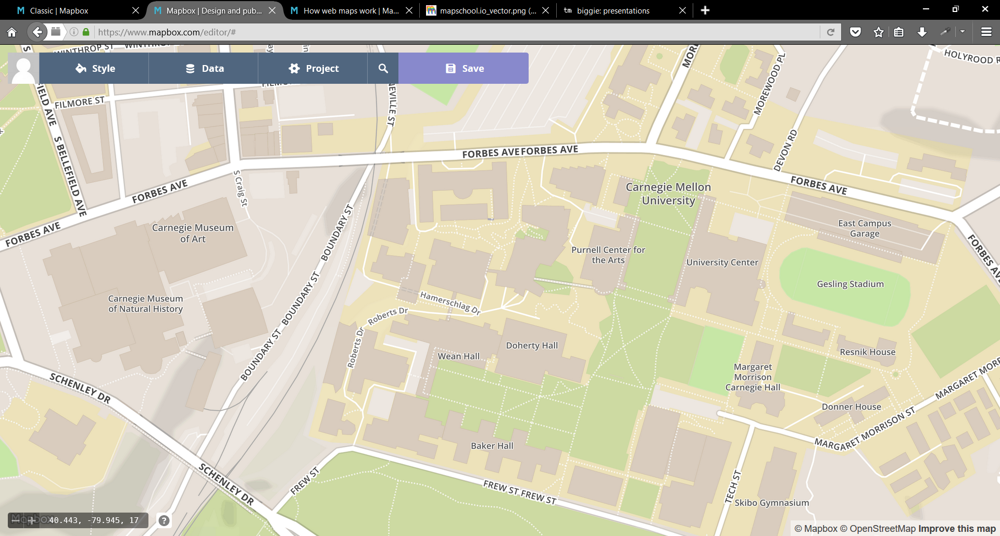

# MaptimePGH

Web Map Cartography with **Mapbox Studio**

---

What is Maptime?

---

* A time for learning about maps
* Hands-on
* Beginner-focused
* Emphasis on open source, programming, and web-mapping

---

* Maps on the www
* Mapbox Studio overview
* Custom cartography walkthrough
* Using your custom base map
* Alternatives

---

# Some things to know about making maps on the WWW

---
## 3 things

* **Your Data**: data that tells story
* **Base Map**: data that provides geo context
* **Coordinate System**: puts everything in place

---

---

---

---

Today we're going to talk (mostly) about designing the **Base Map**

---

* What is this *Base Map* thing?

* Isn't it all a just *web map*?

---

Let's look at some examples.

---

* [Google Maps](www.google.com/maps)
* [Bing Maps](www.bing.com/maps)
* [MapQuest](www.mapquest.com)
* [Open Street Map](www.openstreemap.org)

---

## Data for context

roads, water, buildings, forests, topography, points of interest...

---

**MapQuest**: data from *Open Street Map*, designed using *Mapbox*

---

# [Mapbox](www.mapbox.com)

---

Freemium model software-as-a-service platform for making web maps, apps, data.

---

*Acknowledgement: A good bit of the content shown here comes straight from Mapbox*

---

# Mapbox Studio

---

A tool for the programmatic design of base map cartography

---

A way to style all of the data from Open Street Map (sort of)

---

## Mapbox Terminology

---

**Datasets** vs. **Tilesets**

---

**Datasets:** fully editable geographic data. The data you are telling a story about.

---

**Tilesets:** optimized for quick display of lots of geodata. The format of your base map.

---

We are going to talk (mostly) about **tilesets** today.

---

The base map is comprised of a tileset: many, many individual tiles.

---

---

Tiles are a super-efficient way to serve up lots of geodata.

---

Tiles can be served up as **raster** images (pictures) or **vector** data.

---

---

---

Tiles loaded are dependent on location (X and Y), and zoom (Z) of your map view.

---

Exponential increase in tiles per zoom level that must be stored.

---

---

## ~17 billion tiles

---

Vector data are stored in tiles, but are rendered independent of zoom level.

---

---

* Lighter data storage and transfer burden.
* Heavier rendering burden on your device.

---

Mapbox Studio: a way to *style* all the data for all the tiles at all the zoom levels

---

# Let's dig in!

---

* [Getting Started](https://www.mapbox.com/help/getting-started-mapbox-studio-1/)
* [Home and Welcome screens](https://www.mapbox.com/studio/)
* [Style Gallery](https://www.mapbox.com/gallery/)

---

---

## [Mapbox Studio Editor](https://www.mapbox.com/help/getting-started-mapbox-studio-2/)

---

---

Create a new style from a template:

*Styles* >>> *New Style* >>> *Basic*

---

---

Styles > Layers > Data Sources

---

A **style** is made of links to many **layers**.

Layers are linked from a **data source**.

---

## Data sources

---

---

Mapbox hosts a [curated version of OpenStreetMap](https://www.mapbox.com/vector-tiles/mapbox-streets-v7/) for your use as a data source.

You can also upload your own data.

---

OK, let's make a custom base map

---

## Two approaches

* Customize an existing style
* Create a style from scratch

---

Remember: **maps are communication tools**

---

* data included/excluded
* level of detail shown (or not shown)
* visual priority via color, contrast, negative space

---

---

[Bridges of America](http://jonahadkins.github.io/bridges.html)

---

<iframe src='http://jonahadkins.github.io/bridges.html' height=800 width=1200></iframe>

---

[Oyster Atlas](http://oysteratlas.com/)

---

<iframe src='http://oysteratlas.com/' height=800 width=1200></iframe>

---

[Arctic Sea Ice](https://www.mapbox.com/bites/00183/polarmap.html#4.05/-0.432/-11.580)

---

<iframe src='https://www.mapbox.com/bites/00183/polarmap.html#4.05/-0.432/-11.580'height=800 width=1200></iframe>

---

Remember: imitation is the finest form of flattery,

but give credit where credit is due

---

Also remember: [it's easy to lie with maps](https://www.amazon.com/How-Lie-Maps-Mark-Monmonier-ebook/dp/B00R621P7W/ref=pd_sim_351_2?ie=UTF8&pd_rd_i=B00R621P7W&pd_rd_r=4Z52Q2Z6F7CM88BRN0MV&pd_rd_w=k7U7e&pd_rd_wg=sUpnN&psc=1&refRID=4Z52Q2Z6F7CM88BRN0MV),

but **don't**.

---

## *select data* + *debug* windows

see raw data and compare styles

---

---

# Customize!

---

* [add/remove data](https://www.mapbox.com/help/style-single-country/)
* layers: ordering, finding, styling, selecting
* properties: colors, weights, textures, fonts, labels, size and shape

---

* [palettable.io/](http://www.palettable.io/)
* [Color Brewer](http://colorbrewer2.org)
* [web color tool list](http://www.webdesignbooth.com/the-ultimate-list-of-online-color-tools-for-web-developers/)
* [multi-hued color scales](https://vis4.net/blog/posts/mastering-multi-hued-color-scales)

---

---

* [filter data by attribute/value](https://www.mapbox.com/help/filter-layer-studio/)
* adjust style properties by zoom
* [adjust properties en-masse](https://www.mapbox.com/help/property-types/)

---

**Not everything from a layer is showing all the time!?**

---

Mapbox's curated OSM data source has some pre-applied filters. [Read more here.](https://www.mapbox.com/vector-tiles/mapbox-streets-v7/)

---

e.g.,: **building**

"Large buildings appear at zoom level 13, and all buildings are included in zoom level 14 and up."

---

OK! I have some data representing *some theme*. Should I load/style it with Mapbox Studio?

---

# Maybe!

---

use tileset for data visualization when

* geometrically complex and/or numerous data points
* colors/legend alone can communicate meaning intuitively
* attributes are shallow

---

(later on, use the [Query Rendered Features API](https://www.mapbox.com/mapbox-gl-js/example/queryrenderedfeatures/): accessing tileset data attrs in pop-ups)

---

# PUBLISH

---

# Using your styles in your web maps

* [Mapbox GL](https://www.mapbox.com/mapbox-gl-js/api/), [Mapbox.js/Leaflet](https://www.mapbox.com/mapbox.js/example/v1.0.0/stylelayer/)
* [Open Layers](https://www.mapbox.com/help/mapbox-with-openlayers/)
* [CARTO](https://www.mapbox.com/help/cartodb/)
* [ArcGIS Online](https://www.mapbox.com/help/arcgis-online-mapbox-basemap/)
* [QGIS, ArcMap (desktop)](https://www.mapbox.com/help/mapbox-arcgis-qgis/)

---

# Alternatives

---

[OSM2VectorTiles](http://osm2vectortiles.org/)
+
[Maputnik](https://www.kickstarter.com/projects/174808720/maputnik-visual-map-editor-for-mapbox-gl)

---

#Thanks!

---

* [maptime.io/pittsburgh](http://maptime.io/pittsburgh)
* [@maptimepgh](https://twitter.com/maptimePGH)
* [@GassChristianB](https://twitter.com/GassChristianB)
